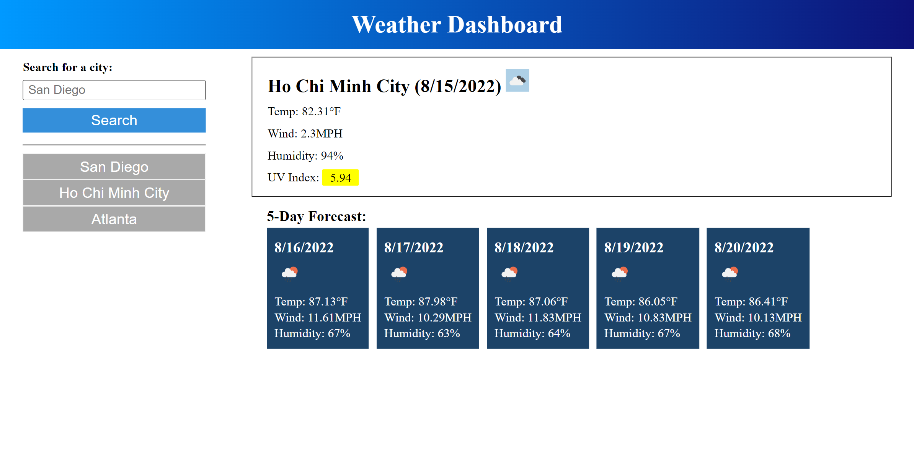
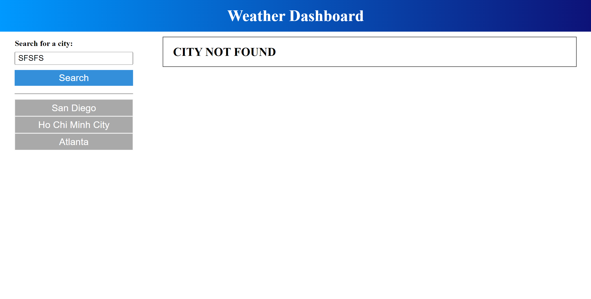

# Weather Dashboard

## About The Project

This App is to show weather of a city at its current weather. It also forecasts the weather of the next 5 days. Using the [OpenWeather One Call API](https://openweathermap.org/api/one-call-api) to retrieve weather data for cities.


## Features

```
    User is able to search for a city and will be shown the current weather and the forecasting weather of the next 5 days.
    The current weather information includes temperature, the humidity, the wind speed and the uv index, which is colored to indicates whether its conditions are favorable, moderate or severe.
    When user click on the search button, the city will be saved in the search history.
    The city saved in the search history is click-able to faster retrieve weather information.
```

## Mock-Up

Please follow [https://odthientho.github.io/w6c-weather-dashboard/](https://odthientho.github.io/w6c-weather-dashboard/) to the deployed Weather Dashboard.

## Screenshots

### City Found


### City Not Found
